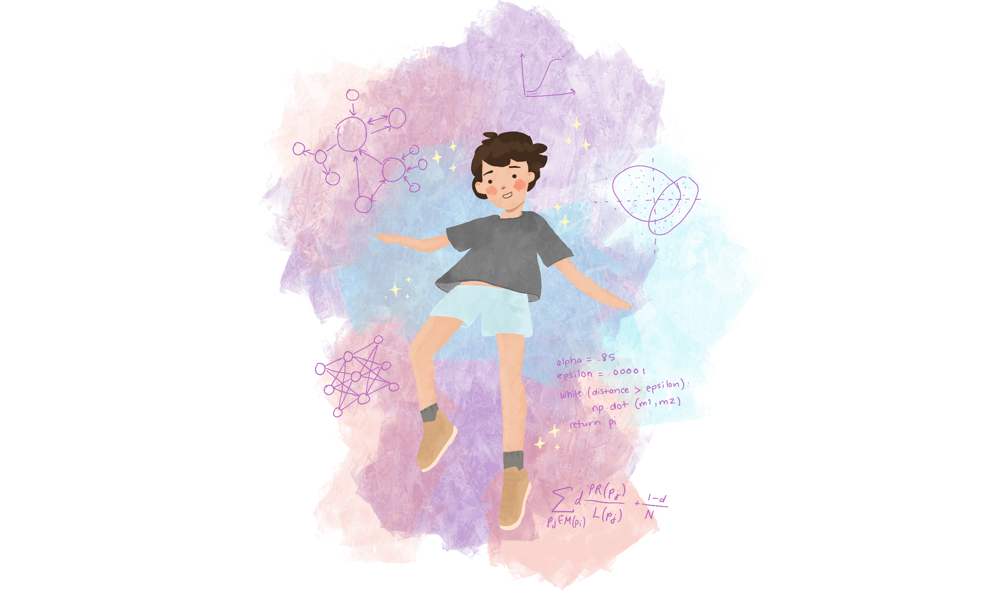

```{r setup, include=FALSE, cache=TRUE}
knitr::opts_chunk$set(echo = TRUE, warning = FALSE, message = FALSE)

```

```{r, include=FALSE}
library(tidyverse)
library(knitr)
library(plotly)
library(DT)

```




## Summary of Article

[Link to the article: It's all Training Data](https://thegradient.pub/its-all-training-data/)

The article talks about machine learning models, and how it relates to the way humans learn from their past experiences. The human mind is biased because of the experiences of the person. The experiences in our brain are similar to the data fed into machine learning models, and we can explain our traumas and fears with the fact that our brains were trained by "unhealthy models." The author draws similarities between common life lessons and machine learning models. Notably, a machine learning model's tendency to over fit can be used to explain why a few experiences of a person can lead to vast generalizations. The author's point is that the extreme similarities between machine learning models and the human brain can allow us to view ourselves in a different way, like a machine learning engineer. Similarly to algorithms that work to correct machine learning models, we can use similar methods to heal our traumas.

## Author Information

Yim Lucky Register (they/them) is a PhD candidate at the UW iSchool. They are studying machine learning education and algorithmic bias.They are also studying how people can combat algorithms that harm them.

## What do I think?
I think this analogy is quite beautifully crafted. I never thought of the similarities between the training of machine learning models and how the human brain learns. In hindsight, these similarities are very obvious and can help people move past their traumatic events. It teaches people that we are often a product of our environment, and that many of the burdens carried by us are not our fault.

## Further Research (if interested){.tabset}

### Links
[The singularity isn’t here yet. Biased AI is.](https://www.skynettoday.com/editorials/biased-ai)

[Towards Human-Centered Explainable AI: the journey so far](https://thegradient.pub/human-centered-explainable-ai/)


### Discussion
The thing I liked the most in this article was when the author explained that many times, our biases are not intrinsically our fault because of "bad data" that our brain was given at a young age. I think this mentality can help many victims of trauma move past these terrible memories because they will be able to recognize that those feelings in their minds are due to the experiences they had, not because of who they are.

## Japan Credit Datatable with DT
```{r echo=FALSE, message=FALSE, warning=FALSE, paged.print=TRUE, out.width='50%', fig.align='center'}
japan_credit = read_csv("../data/japan_credit.csv")
clean = data.frame(japan_credit["age"], japan_credit["gender"], japan_credit["race"])
DT::datatable(clean)
```