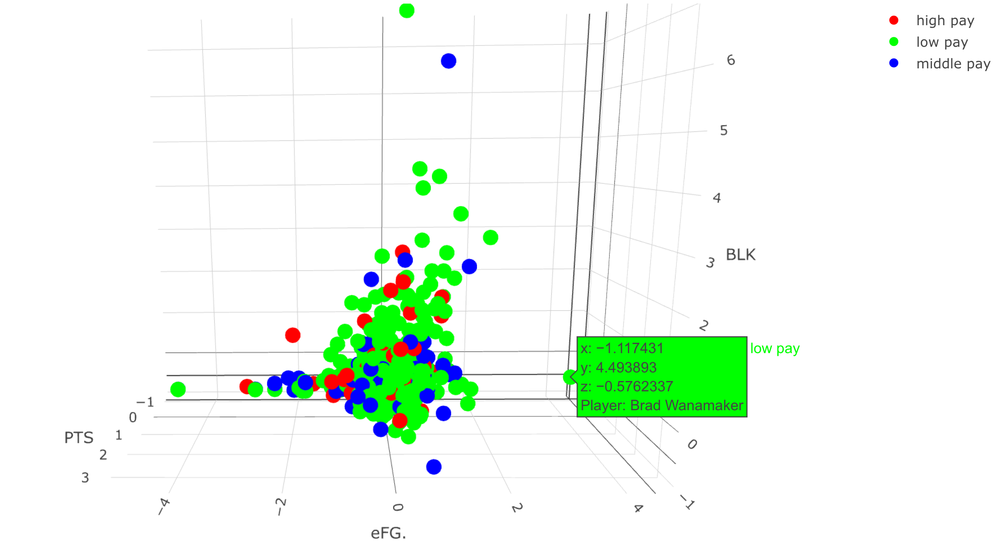
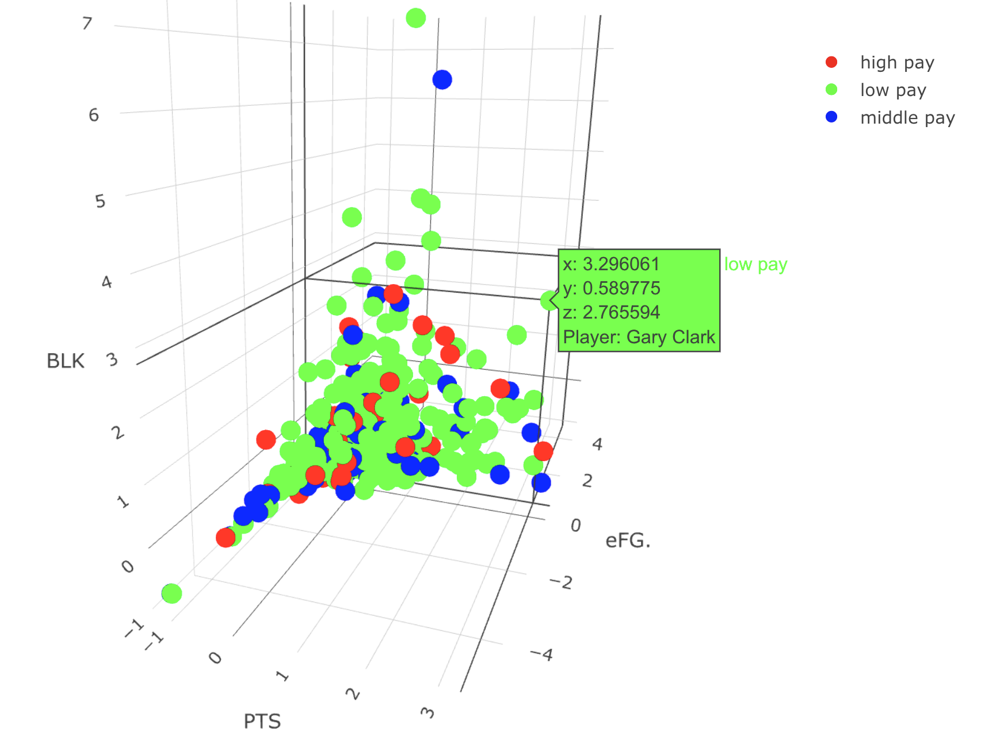
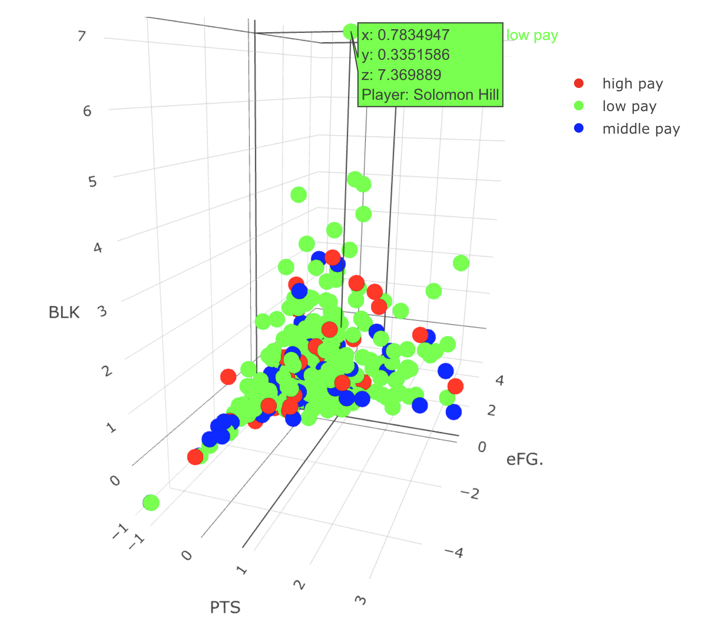

```{r setup, include=FALSE, results='hide', message=FALSE}
knitr::opts_chunk$set(echo = FALSE)
knitr::opts_chunk$set(results = "hide")
knitr::opts_chunk$set(message=FALSE)
knitr::opts_chunk$set(warning=FALSE)
```

```{r,  results='hide'}
library(tidyverse)
library(plotly)
library(htmltools)
library(devtools)
library(caret)
```

```{r}
##Load the data
nba_data = read.csv("../data/nba2020-21.csv")

nba_salaries = read.csv("../data/nba_salaries_21.csv")

combined_data = inner_join(nba_data, nba_salaries)
## Add an ID column because some names are repeated
combined_data = tibble::rowid_to_column(combined_data, "ID")

```

After looking through the data, I decided to use 3 different metrics to try and find low paying and high performing players. I believe that the most important traits of a player include the number of points they score (PTS), the number of blocks they can execute (BLK) and their effective field goal percentage (eFG.). This is because points will help the team win the game, while blocks will prevent the enemy team from scoring too much. eFG. is there to help ensure that our players have a certain level of accuracy, which is desired among basketball players.


```{r}
##Select the variables to be included in the cluster 
cols = c("ID", "Player", "PTS", "BLK","eFG.", "X2020.21")
clust_data_nba = combined_data[, cols]
clust_data_nba = clust_data_nba[complete.cases(clust_data_nba),]

standardize = function(data_in){
  ###standardizing numeric data
  (new_data <- scale(data_in, center = TRUE, scale = TRUE))
  new_data
}

ID = clust_data_nba$ID
drops = c("ID")
clust_data_nba = clust_data_nba[ , !(names(clust_data_nba) %in% drops)]

numeric_cols = names(select_if(clust_data_nba, is.numeric))

### Standardizing numeric columns
clust_data_nba[numeric_cols] <- as_tibble(lapply(clust_data_nba[numeric_cols], standardize))

clust_data_nba$ID = as.factor(ID)
standardized_complete_set = clust_data_nba

```

I first started by categorizing players based on their salary. I wanted to create a categorical variable that indicated whether the player was in the "low pay", "middle pay" or "high pay" range of salary. I decided to use 3 clusters for the salary after much experimentation. The results of my experimentation are in the bar graph below, which shows that there is a decent amount of players in each category.

```{r}
## Start by trying to cluster the salary into 3 categorical variables (low pay, middle play and high pay)
nba_player_salary_clust = data.frame(clust_data_nba["X2020.21"])
set.seed(1)
salary_kmeans_obj = kmeans(nba_player_salary_clust, centers = 3, algorithm = "Lloyd", iter.max = 30)

salary_kmeans_obj$betweenss / salary_kmeans_obj$totss
### Clustering the salaries into 3 clusters gives me a within cluster sum of squares by cluster of 90.6%.

salary_cluster = as.factor(salary_kmeans_obj$cluster)
### Plot out the salary clusters
ggplot(nba_player_salary_clust, aes(x = X2020.21, 
                            # y = X2020.21,
                            color = salary_cluster,
                            shape = salary_cluster)) + 
  geom_bar(size = 4) +
  ggtitle("Clusters of NBA Basketball Player salaries") +
  xlab("Standardized Salary of NBA basketball players") +
  scale_shape_manual(name = "Cluster", 
                     labels = c("Cluster 1", "Cluster 2", "Cluster 3"),
                     values = c("1", "2", "3")) +
  scale_color_manual(name = "Groups",        
                     labels = c("Cluster 1", "Cluster 2", "Cluster 3"),
                     values = c("red", "blue", "green")) +
  theme_light()

ID = standardized_complete_set["ID"]

player_salaries_cluster = data.frame(ID, salary_cluster)

str(player_salaries_cluster)

salary_group = c("high pay", "middle pay", "low pay")
salary_cluster = c("1", "2", "3")
color = c("red", "blue", "green")

salary_cluster_labels = data.frame(salary_group,salary_cluster, color )

salary_group_join_clusters = inner_join(player_salaries_cluster, salary_cluster_labels)
str(salary_group_join_clusters)

standardized_complete_set = inner_join(standardized_complete_set, salary_group_join_clusters)
standardized_complete_set = standardized_complete_set[ , !(names(standardized_complete_set) %in% c("salary_cluster"))]

### As we can see, the salaries can be clustered into 3 categories.

  
```

With the players categorized by their salary, I tried to discover how many clusters would be needed to categorize the performance variables (PTS, BLK and .eFG). I used this function to try and find how much the clustering explained the variance.
```{r, echo=TRUE}
## Evaluate several different number of clusters
explained_variance = function(data_in, k){
  ### Running the kmeans algorithm.
  set.seed(1)
  kmeans_obj = kmeans(data_in, centers = k, algorithm = "Lloyd", iter.max = 30)
  
  ### Variance accounted for by clusters:
  ### var_exp = intercluster variance / total variance
  var_exp = kmeans_obj$betweenss / kmeans_obj$totss
  var_exp  
}

```

```{r}

player_names = clust_data_nba[0:1]

salaries = clust_data_nba$X2020.21
### Removing irrelevant data to the kmeans clustering
drops = c("Player", "salary_group", "X2020.21")
clust_data_nba = clust_data_nba[ , !(names(clust_data_nba) %in% drops)]

### Apply my function to the dataframe we have
explained_var_nba = sapply(1:10, explained_variance, data_in = clust_data_nba)

elbow_data_nba = data.frame(k = 1:10, explained_var_nba)
```

I plotted the variance explained out to use the elbow method, it looks like 3 clusters is a good choice.
```{r}
## Create a elbow chart of the output 
ggplot(elbow_data_nba, 
       aes(x = k,  
           y = explained_var_nba)) + 
  geom_point(size = 4) +           
  geom_line(size = 1) +          
  xlab('k') + 
  ylab('Inter-cluster Variance / Total Variance') + 
  theme_light()

### With the elbow method, it looks like 3 clusters is a good choice
```


I them proceeded to create three clusters for performance and overlay the pay range clusters (low, middle and high). I got some promising results below. Here, we can see that there are some players in the "low pay" range who perform quite well in certain areas. The withinSS I got was 88.9%.
```{r}
set.seed(1)
kmeans_obj_nba_3clust = kmeans(clust_data_nba, centers = 3, 
                        algorithm = "Lloyd")

kmeans_obj_nba_3clust$betweenss / kmeans_obj_nba_3clust$totss
## Within cluster sum of squares by cluster: 88.9%

```
```{r}
## Generate some plots for analysis
salary_clusters_nba = as.factor(kmeans_obj_nba_3clust$cluster)

### Points and Blocks
ggplot(standardized_complete_set, aes(x = PTS, 
                            y = BLK,
                            color = standardized_complete_set$color,
                            shape = salary_clusters_nba)) + 
  geom_point(size = 3) +
  ggtitle("Points gained vs Blocks gained") +
  xlab("Standardized Points Gained By Players") +
  ylab("Standardized Blocks By Players") +
  scale_shape_manual(name = "Cluster", 
                     labels = c("Cluster 1", "Cluster 2", "Cluster 3"),
                     values = c("1", "2", "3")) +
  scale_color_manual(name = "Groups",         
                     labels = c("low pay", "middle pay", "high pay"),
                     values = c("green", "blue", "red")) +
  theme_light()

### Points and Effective Field Goal %
ggplot(standardized_complete_set, aes(x = PTS, 
                            y = eFG.,
                            color = standardized_complete_set$color,
                            shape = salary_clusters_nba)) + 
  geom_point(size = 3) +
  ggtitle("Points gained vs Effective Field Goal %") +
  xlab("Standardized Points Gained By Players") +
  ylab("Standardized Effective Field Goal %") +
  scale_shape_manual(name = "Cluster", 
                     labels = c("Cluster 1", "Cluster 2", "Cluster 3"),
                     values = c("1", "2", "3")) +
  scale_color_manual(name = "Groups",        
                     labels = c("low pay", "middle pay", "high pay"),
                     values = c("red", "blue", "green")) +
  theme_light()

### As we can see, there are a few candidates in these plots (low pay but high performance.) Let's analyze them in a 3D Graph.
```

However, these 2D graphs will not be enough for us to find good players. A 3D graph will allow us to see the clusters in their entirety. This interactive model is shown below.

```{r, results='show'}
## 3D graph with Blocks, Points and Effective Field Goal %

salary_pts_blk_3d = standardized_complete_set
salary_pts_blk_3d$cluster = salary_clusters_nba
cluster_colors = data.frame(cluster = c("1", "2", "3"),
                               color = c("red", "blue", "green"))
salary_pts_blk_3d = inner_join(salary_pts_blk_3d, cluster_colors)

salary_pts_blk_3d$Player <- gsub("[^[:alnum:]]", "_", salary_pts_blk_3d$Player)

fig <- plot_ly(standardized_complete_set, 
               type = "scatter3d",
               mode="markers",
               x = ~PTS, 
               y = ~eFG., 
               z = ~BLK,
               color = ~salary_group,
               colors = c("#FF0000", '#00FF00','#0000FF'),
               text = ~paste('Player:',Player))
fig

```

As we can see, there are several good candidates for selection. 


Brad Wanamaker is a good choice because he has a high eFG. and his salary is in the "low pay" cluster. There are no players who have a higher eFG. than Wanamaker, even considering the highly paid players. This makes him a very good choice. 


Gary Clark is a good choice because he scores lots of points and can block a lot of offenses while being in the "low pay" cluster. In addition, his eFG. are not too bad (greater than 0). Compared to the other "underpaid" NBA players that score a lot of points, Gary Clark has an additional advantage because of is relatively high BLK score.


Solomon Hill is a good choice because he has a lot of blocks and he scores decently (eFG. > 0 and PTS > 0.75). He massively out performs the other players in the area of blocks, as you can see in the chart. He even outperforms highly paid players in that regard.

Overall, I beleive these players are under paid but highly performant. Using the power of data science, I was able to find players that had low pay, but performed well in the different aspects. I think it's a good idea to have 3 players that are really good at blocking, gaining points and scoring. If they work together, they can be good at both offense and defence. Therefore, I highly recommend these players for our team.


